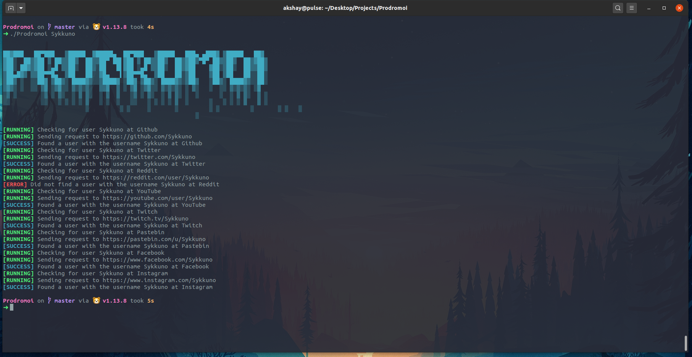

# Prodromoi
An extensible, cross-platform username search engine. 

## About
Ever get tired of those OSINT challenges where you have to find a social media account with a specific username? Well you've come to the right place! With Prodromoi just run `./Prodromoi <USERNAME>` or `.\Prodromoi <USERNAME>`and find user accounts in less than 20 seconds! No need for any of those username search engines when you can just run 1 command!

To compile and use just clone the repo and run `go build` and you're set! (Or just check the releases page)

## Example:


## Configuration and Extensibility
You can easily add some more sites to [config.json](config/config.json) and if you do please open a pull request for it! No addition is too small!

Config:
```json
    {
       "site":"<SITENAME>",
       "host":"<LINK>"
    }
```